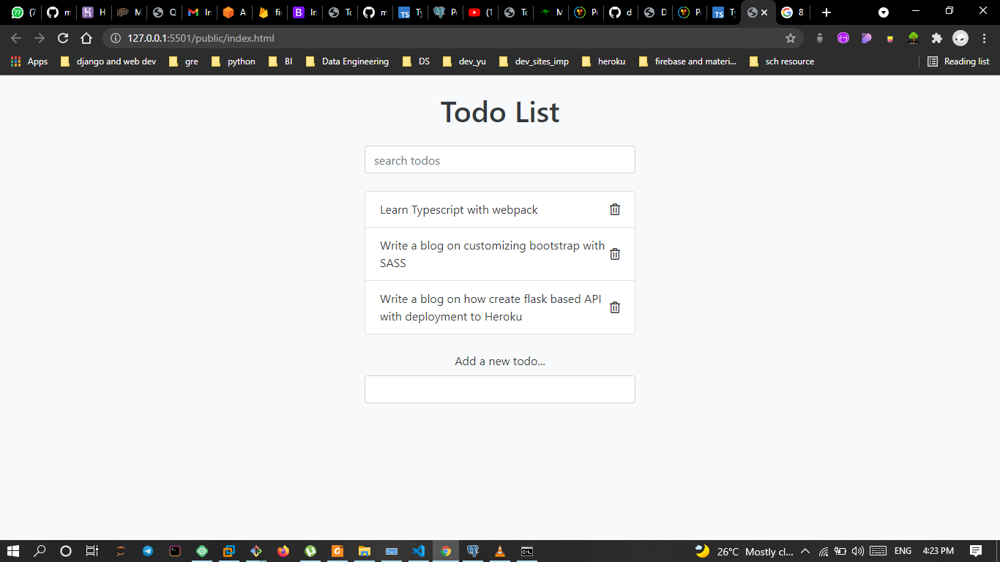

# Todo List App with Typescript and Webpack

A simple todo list application for keeping track of daily tasks.

## Motivation

I began this project to improve my typescript and webpack knowledge.

## Screenshot

[]()

## URL

[Todo List App with Typescript and Webpack](https://xenodochial-yonath-0a3f4f.netlify.app)

## Installation

1. Clone Repo
2. cd to the directory where cloned folder is locacted
3. run: npm install in your shell

```bash
npm install
```

## Tech/framework used

1. HTML5
2. CSS3
3. Bootstrap 4
4. Typescript
5. Webpack

## Contributing

Pull requests are welcome. For major changes, please open an issue first to discuss what you would like to change.

## License

[MIT](https://choosealicense.com/licenses/mit/)
